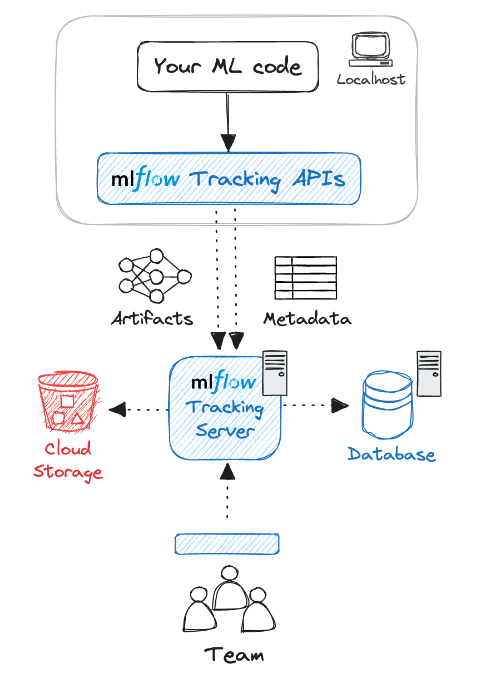

## MLFlow Tracking Server
MLflow Tracking Server is a stand-alone HTTP server that provides REST APIs for accessing backend and/or artifact store. Tracking server also offers flexibility to configure what data to server, govern access control, versioning, and etc.

In such scenario, MLFLow Tracking Server acts as an HTTP proxy, passing artifact requests through the tracking server to store and retrieve artifacts. This helps a development team to store artifacts and experiment metadata in a shared location with proper access control.

## Artifact Store
Artifact store persists (typicaly large) artifacts for each run, such as model weights (e.g. a pickled scikit-learn model), images (e.g. PNGs), model and data files (e.g. Parquet file). MLflow stores artifacts ina a local file (mlruns) by default, but also supports different storage options such as Amazon S3 and Azure Blob Storage.

## Backend (Metadata) Store
The backend store persists various metadata for each Run, such as run ID, start and end times, parameters, metrics, etc. MLflow supports two types of storage for the backend: file-system-based like local files and database-based like PostgreSQL.

## MLFow Tracking API
MLFlow provides Python API to be used in ML code to log runs and communicate with MLFlow Tracking Sderver.

### References

**MLFlow Tracking Server** https://mlflow.org/docs/latest/tracking.html
**MLFlow Tracking API** https://mlflow.org/docs/latest/tracking/tracking-api.html